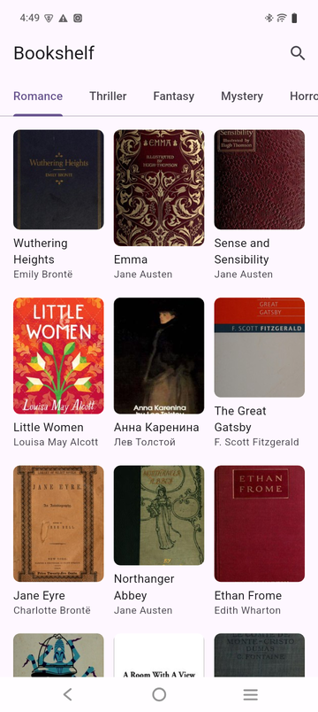
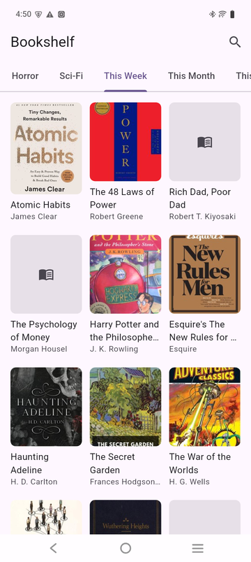
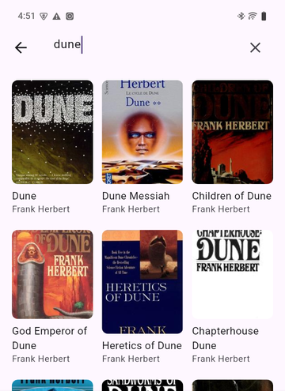
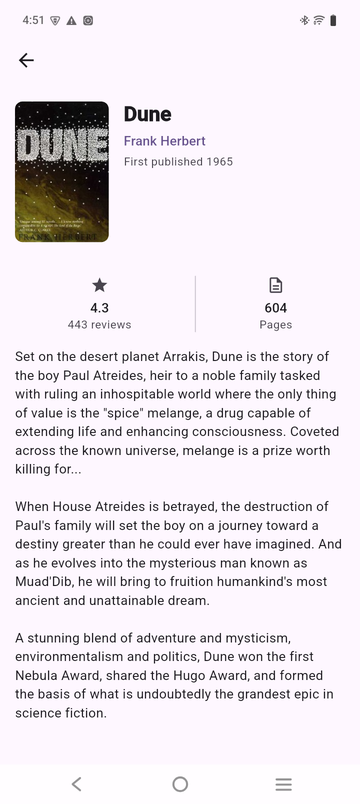
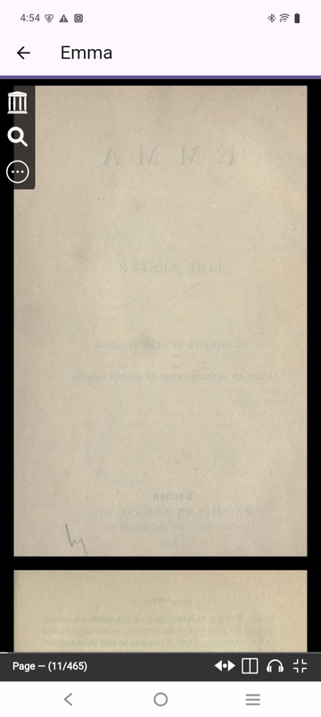

<p align="center">
  
</p>

<h1 align="center">Bookshelf</h1>

<p align="center">
  A Flutter app for browsing, searching, and reading public-domain books,
  built on the <a href="https://openlibrary.org/developers/api">Open Library API</a>.
</p>

## Features

| Browse by genre | Browse by trending period | Search |
| :---: | :---: | :---: |
|  |  |  |

| Book details | Free books unlock a reader |
| :---: | :---: |
|  |  |

| In-app reader | Author pages |
| :---: | :---: |
|  |  |

- **Browse** — trending books by period (this week / month / year / all
  time) and by genre (romance, thriller, fantasy, mystery, horror, sci-fi),
  each backed live by Open Library's trending and subjects APIs.
- **Search** — debounced search-as-you-type over Open Library's full catalog.
- **Book details** — cover, rating, page count, and description, pulled
  from Open Library's work/edition/ratings APIs.
- **Read for free** — books with a public-domain scan on Internet Archive
  get a **Read now** button that opens an in-app reader; otherwise a
  **Borrow on Archive.org** link opens the lending page externally.
- **Author pages** — tap any author's name for their photo, bio, and
  birth/death dates.
- Shimmer loading states throughout, and a native splash screen shown from
  process start.

## Architecture

Feature-first, clean-architecture layering (`domain` / `data` /
`presentation`) per feature, with cross-cutting concerns under `core/`:

```
lib/
├── core/            # network client, error types, router, constants, shared widgets
└── features/
    ├── home/        # tab/grid composition screen
    ├── books/       # trending, subjects, search
    ├── book_details/ # book detail, ratings, read/borrow access
    ├── reader/      # in-app WebView reader
    └── author/      # author profile
```

Each feature is independently layered:

```
presentation → domain ← data
```

- `domain/` is plain Dart — no Flutter, Riverpod, Dio, or GoRouter imports.
- `data/` implements the interfaces `domain/` declares, and translates
  infrastructure exceptions into domain `Failure`s.
- `presentation/` wires everything together with Riverpod (code-generated
  `@riverpod` providers) and GoRouter.

Features depend on each other only through narrow, one-directional seams —
e.g. `book_details` depends on `books` for the `Book` entity type and on
`reader`/`author` for their route names, but `books` (trending/search) has
no dependency on book-detail or read-access concerns at all.

See [`CLAUDE.md`](CLAUDE.md) for the full architecture and convention guide.

## Tech stack

- **Flutter** / **Dart**, null-safe
- **Riverpod** with code generation (`riverpod_generator`) for state
  management and dependency injection
- **go_router** for navigation
- **Dio** for networking, with logging/error/auth interceptors
- **webview_flutter** for the in-app book reader
- **shimmer** for loading skeletons
- **flutter_native_splash** for the native splash screen

## Getting started

```bash
flutter pub get
dart run build_runner build --delete-conflicting-outputs
flutter run
```

### Other useful commands

```bash
flutter analyze                          # static analysis
flutter test                             # run tests
dart run build_runner watch --delete-conflicting-outputs  # codegen while iterating
```

## Data source

All book, author, and cover data comes from the [Open Library
API](https://openlibrary.org/developers/api) — no API key required. Free
in-app reading is powered by [Internet Archive](https://archive.org)'s
public-domain scans.
